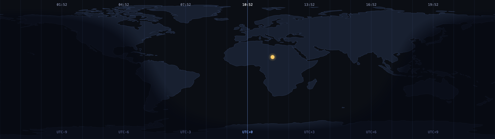
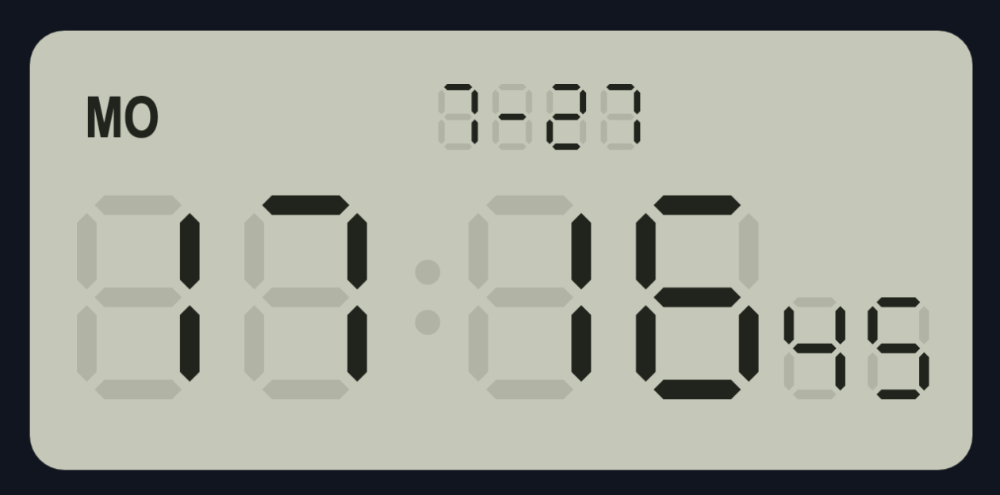
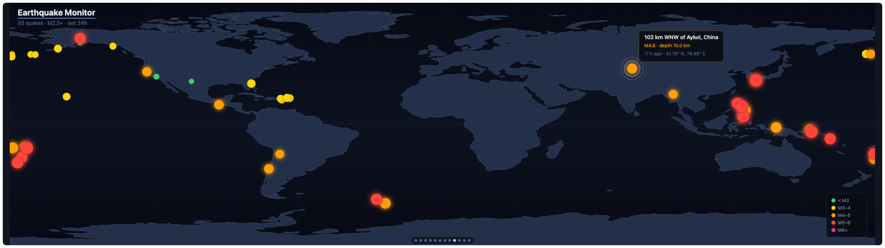
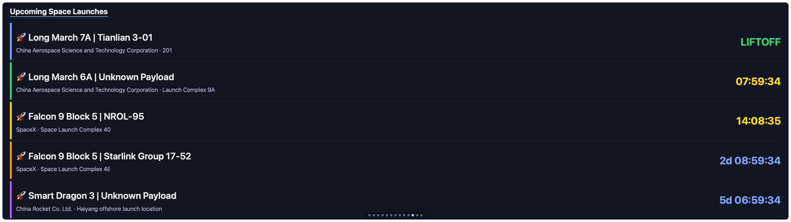

# Vardek Add-on Widgets

Community / add-on widgets for **[Vardek](https://vardek.app)** — the macOS
dashboard for the Corsair Xeneon Edge. Get the app first:
[vardekapp/Vardek](https://github.com/vardekapp/Vardek) · [vardek.app](https://vardek.app).

The Vardek app ships with a curated set of built-in widgets. This repo holds
**add-on widgets** you can install *after the fact* — no app update, no rebuild.
Vardek scans a user widgets directory alongside its bundled ones, so dropping a
widget folder in and rescanning is all it takes.

## Widgets

| Widget | id | Size | What it does |
|--------|----|------|--------------|
| [Day/Night Map](com.vardek.day-night/) | `com.vardek.day-night` | 8×2 | World map with a live day/night terminator and UTC-offset time ticks. Pure client-side solar math, no network. |
| [LCD Watch](com.vardek.lcd-watch/) | `com.vardek.lcd-watch` | 4×2 / 2×1 | Retro Casio F-91W–style digital clock — seven-segment time/date with ghost segments, blinking colon, backlight toggle. Local clock, no network. |
| [Life Progress](com.vardek.life-progress/) | `com.vardek.life-progress` | 8×2 / 4×2 | Horizontal progress bars — life, year, month, week, day. Pure client-side, no network. |
| [Earthquake Monitor](com.vardek.earthquake/) | `com.vardek.earthquake` | 8×2 | World map of recent quakes, colored by magnitude — tap a quake for details (USGS, keyless). |
| [ISS Tracker](com.vardek.iss/) | `com.vardek.iss` | 8×2 | Standalone world map with the ISS's live position, trail, and projected orbit — accurate SGP4 from Celestrak TLE (keyless). |
| [Space Launch Schedule](com.vardek.space-launch/) | `com.vardek.space-launch` | 4×2 / 8×2 | Upcoming rocket launches with color-coded live countdowns (Launch Library 2, keyless). |

### Day/Night Map
[](com.vardek.day-night/)

### LCD Watch
[](com.vardek.lcd-watch/)

### Life Progress
[](com.vardek.life-progress/)

### Earthquake Monitor
[](com.vardek.earthquake/)

### ISS Tracker
[](com.vardek.iss/)

### Space Launch Schedule
[](com.vardek.space-launch/)

## Install

**Option A — script (easiest):**

```sh
git clone https://github.com/vardekapp/vardek-widgets
cd vardek-widgets
./install-addon.sh com.vardek.day-night
```

The script copies the folder to `~/Library/Application Support/Vardek/widgets/`
and rescans the running daemon. Then open Admin (`http://127.0.0.1:8137/admin`),
find the widget, and place it.

**Option B — manual:**

1. In Vardek Admin, click **Reveal** on the widget library — this opens
   `~/Library/Application Support/Vardek/widgets/` in Finder.
2. Copy the widget folder (e.g. `com.vardek.day-night/`) into it.
3. Click **Rescan** in Admin. The widget appears in the library — place it.

Either way: **no app reinstall, no restart.**

## Uninstall

Delete the widget folder from `~/Library/Application Support/Vardek/widgets/` and
click **Rescan** (or remove it from your layout in Admin first).

## Authoring your own

See [AUTHORING.md](AUTHORING.md) for the widget contract (manifest, settings,
sizes) and the runtime constraints. PRs adding new widgets are welcome.

## Trust & safety

Add-on widgets are HTML/JS that run in Vardek's sandboxed iframe (opaque origin,
CSP, network calls confined to a per-widget proxy allowlist). The sandbox limits
what a widget can do, but a widget can still use the capabilities it declares
(network hosts in its manifest, any secrets you grant it in Admin) — treat
installing one like installing a browser extension. Only install widgets whose
source you're comfortable with. Everything here is source-viewable — read before
you install.

## License

Widgets and tooling in this repo: [MIT](LICENSE). The Vardek app itself is a
separate, closed-source product.
