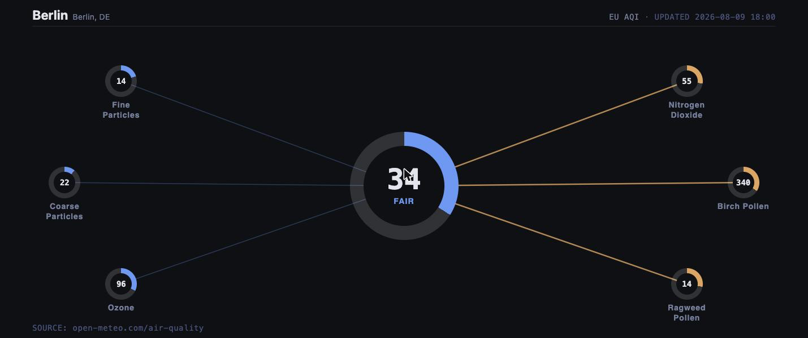

# Air Quality

A radial instrument: one giant Ring Gauge reads the current AQI, smaller
gauges orbit it for whichever individual pollutants you pick, each joined to
the center by a spoke line that lights up amber or red only when that
pollutant is actually elevated.

- **City search.** Type any city in settings; the widget geocodes it and
  fetches current air quality for that location.
- **US or European AQI** as the hero scale, your choice in settings.
- **Pick your pollutants.** Toggle any of sixteen Open-Meteo hourly
  air-quality variables (ten pollutants plus six pollen species) on or off
  in settings — each shown one gets its own mini gauge and tone, so you can
  see at a glance which pollutant is driving an elevated reading, not just
  that the air is bad. The gauges fan out to fit however many you pick, up
  to 10 at once — past that the panel gets too dense to read at a glance, so
  the widget shows the first 10 and says how many more are selected but
  hidden, rather than overlapping gauges silently.
- **8×2 or 4×2.** Both grid sizes share the same 720px panel height, so
  gauge legibility is identical either way — 4×2 just has less room for
  wide spoke spread.



## Settings

| Key                      | Type    | Default    | Description                         |
|---------------------------|---------|------------|--------------------------------------|
| `city`                     | string  | `New York` | City to look up (geocoded on save)  |
| `scale`                    | enum    | `us`       | Hero AQI scale: `us` or `eu`        |
| `show_pm2_5`                | boolean | `true`     | Fine Particles (PM2.5)              |
| `show_pm10`                 | boolean | `true`     | Coarse Particles (PM10)             |
| `show_ozone`                | boolean | `true`     | Ozone                                |
| `show_nitrogen_dioxide`     | boolean | `true`     | Nitrogen Dioxide                     |
| `show_sulphur_dioxide`      | boolean | `true`     | Sulfur Dioxide                       |
| `show_carbon_monoxide`      | boolean | `true`     | Carbon Monoxide                      |
| `show_carbon_dioxide`       | boolean | `false`    | Carbon Dioxide                       |
| `show_ammonia`              | boolean | `false`    | Ammonia                              |
| `show_methane`              | boolean | `false`    | Methane                              |
| `show_dust`                 | boolean | `false`    | Dust                                 |
| `show_alder_pollen`         | boolean | `false`    | Alder Pollen *                       |
| `show_birch_pollen`         | boolean | `false`    | Birch Pollen *                       |
| `show_grass_pollen`         | boolean | `false`    | Grass Pollen *                       |
| `show_mugwort_pollen`       | boolean | `false`    | Mugwort Pollen *                     |
| `show_olive_pollen`         | boolean | `false`    | Olive Pollen *                       |
| `show_ragweed_pollen`       | boolean | `false`    | Ragweed Pollen *                     |

\* Only available in Europe during pollen season, with 4 days forecast
(Open-Meteo). Outside that window the gauge just reads "—".

## Install

```sh
./install-addon.sh com.vardek.air-quality
```

See the [repo README](../README.md) for manual install and uninstall.

## Data

[Open-Meteo Air Quality API](https://open-meteo.com/en/docs/air-quality-api)
and its [Geocoding API](https://open-meteo.com/en/docs/geocoding-api) —
both public, keyless. Pollutant severity tiers are a simplified 3-level
approximation (good/elevated/critical), not a regulatory multi-averaging
-period standard — good for a glance, not for compliance reporting.

**API limit:** the free Open-Meteo tier is non-commercial use only,
rate-limited to [10,000 calls/day (5,000/hour, 600/minute)](https://open-meteo.com/en/pricing),
no uptime guarantee. This widget makes 2 calls per refresh (geocode + air
quality) at its default 1800s (30 min) `refreshInterval` — about 96 calls/day
per installed instance, well inside the free limit under normal use.
