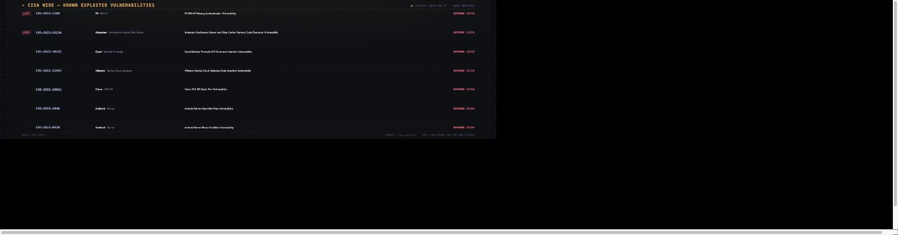

# CISA Known Exploited Vulnerabilities

A wire-service bulletin roll of CISA's Known Exploited Vulnerabilities (KEV)
catalog — CVEs with confirmed active exploitation that federal agencies are
mandated to patch by a hard due date.

- **Sorted by due date** by default (oldest/most-overdue first) so the widget
  reads as a live triage queue; switch to newest-added in settings.
- **RUSH stamp** marks entries CISA has flagged for active ransomware
  campaign use.
- **Tap a bulletin** to open its NVD record in your default browser.
- The feed lists newest-first and only the most urgent rows are shown, so the
  widget stays accurate even though the daemon's outbound proxy caps
  responses at 1 MB and the live catalog now runs larger than that — older
  history past the cutoff is simply never displayed.



## Settings

| Key              | Type    | Default   | Description                              |
|------------------|---------|-----------|-------------------------------------------|
| `sort`           | enum    | `dueDate` | Sort by due date or newest added (dueDate/dateAdded) |
| `rowCount`       | enum    | `7`       | Rows shown (5/7/10)                       |
| `ransomwareOnly` | boolean | `false`   | Show only ransomware-flagged entries      |

## Install

```sh
./install-addon.sh com.vardek.cisa-kev
```

See the [repo README](../README.md) for manual install and uninstall.

## Data

Live catalog from [CISA's Known Exploited Vulnerabilities feed](https://www.cisa.gov/sites/default/files/feeds/known_exploited_vulnerabilities.json)
(public domain, no key required). Tapping a bulletin opens its record at
`nvd.nist.gov`, built from the CVE ID — no extra request.
