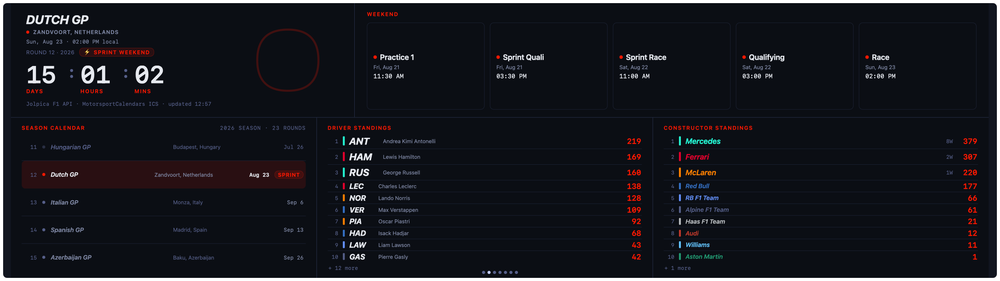

# F1 Schedule Widget

A Formula 1 dashboard widget: next race, weekend schedule, season calendar, and both championship standings on one glanceable surface — no tabs, everything visible at once.

## What It Shows

- **Next-race hero:** Countdown to the next race (days / hours / mins), a flat circuit-outline watermark, round/season and sprint-weekend badge, and a live/finished state during and after the race (the live state shows real elapsed time, not an estimated lap count).
- **Weekend timeline:** All sessions for the upcoming race weekend (Practice 1–3, Qualifying, Sprint Qualifying, Sprint Race, Race) as a left-to-right chip timeline with per-session status (upcoming / live / done) and local start times.
- **Season calendar:** A rolling window of upcoming races with round numbers, circuit locations, race dates, and sprint-weekend badges, centred on the next race per the `racesToShow` setting.
- **Standings:** Side-by-side top-10 driver and constructor championships with team colours, and an honest "+ N more" line for entries beyond the top ten.

## Data Sources

| Source | Used for | Key required? |
|---|---|---|
| [Jolpica F1 API](https://api.jolpi.ca) (`api.jolpi.ca`) | Season schedule, driver standings, constructor standings | No |
| [OpenF1](https://openf1.org) (`api.openf1.org`) | Session times fallback (used only when the ICS feed fails) | No |
| [MotorsportCalendars ICS](https://motorsportcalendars.com) (`files-f1.motorsportcalendars.com`) | Precise session start times, sprint-weekend detection | No |

No API key is required for any source.

## Settings

| Key | Type | Default | Range | Description |
|---|---|---|---|---|
| `racesToShow` | number | `5` | 3–8 | Number of races to display in the season calendar |

## Upstream Outage Behaviour

If the primary Jolpica API is unreachable on first load, the widget shows a graceful error overlay ("Data error: …"). The overlay disappears automatically on the next successful refresh (hourly, per the manifest's `refreshInterval`). If only the ICS feed fails, the widget falls back to OpenF1 for session times; if both are unavailable the weekend timeline shows a "No session data available" message while the rest of the widget continues to function normally. On a failed refresh the existing data stays on screen and the footer marks it "· stale" until the next successful fetch.
