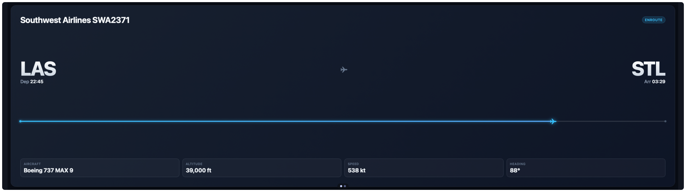
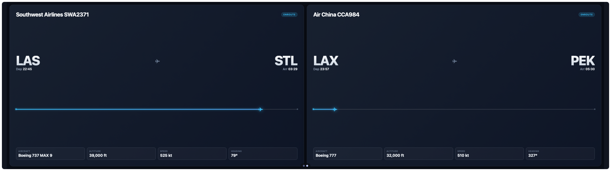
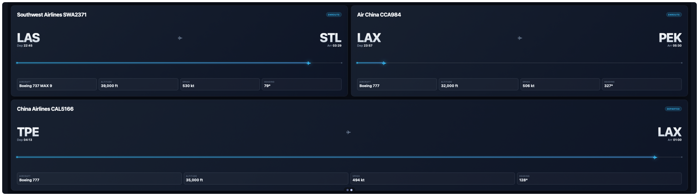
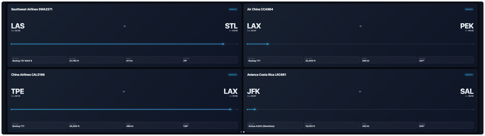

# Flight Tracker

Track up to 4 flights on one 8×2 panel — flight number, route with a live
great-circle progress marker, departure/arrival times, aircraft type, and live
altitude/speed/heading when available. Glass-card visual style with a
configurable accent color.

The layout adapts automatically to how many flights you configure, each
getting a proportionally bigger card (and bigger text) the fewer there are:

| Flights tracked | Layout |
|------------------|--------|
| 1 | full panel |
| 2 | left half / right half |
| 3 | top-left quarter, top-right quarter, bottom half |
| 4 | four quarters |






## Settings

| Key               | Type   | Default   | Description                                    |
|-------------------|--------|-----------|--------------------------------------------------|
| `flightCodes`     | string | `UA804`   | Comma-separated flight numbers (IATA or ICAO), up to 4 |
| `accentColor`     | color  | `#38bdf8` | Accent color for the status badge, progress bar, and plane marker |
| `AERODATABOX_KEY` | secret | —         | Your AeroDataBox API key (via RapidAPI)          |

## Getting a free API key

This widget needs your own AeroDataBox key — free to get, no built-in key is
shipped with the widget.

1. Sign up for a free [RapidAPI](https://rapidapi.com) account (no credit
   card needed to browse/subscribe to free-tier APIs).
2. Go to [AeroDataBox on RapidAPI](https://rapidapi.com/aedbx-aedbx/api/aerodatabox)
   and click **Subscribe** — pick the free "Basic" plan. Subscribing is a
   separate step from just having a RapidAPI account; both are required.
3. Once subscribed, copy your key from the **X-RapidAPI-Key** field shown on
   that page (also under your RapidAPI account → My Apps → Security).
4. In Vardek Admin, open this widget's settings and paste it into the
   **AeroDataBox API Key** field. It's stored in the macOS Keychain and never
   exposed to the widget itself.

The free plan has both a small monthly quota and a per-second burst limit —
see [Rate limits](#rate-limits) below for what to expect.

## Install

```sh
./install-addon.sh com.vardek.flight-tracker
```

See the [repo README](../README.md) for manual install and uninstall.

## Data

Live flight data from [AeroDataBox](https://aerodatabox.com) via RapidAPI —
requires your own API key (see above). Altitude, speed, and heading come from
ADS-B coverage and may be missing on some refreshes (e.g. on the ground, or
outside receiver range) — this is normal, not an error.

Not intended for time-critical or safety use — treat it as informational only.

## Rate limits

The widget fetches all configured flights once per `refreshInterval` (default
**1 hour**), one at a time with a short stagger between requests (not all at
once) — with 4 flights that's ~96 API calls/day at the default interval.

AeroDataBox's free RapidAPI tier has both a small daily/monthly quota and a
per-second burst limit — a `429` in the widget means you've hit one of them,
not a bug. If only some of your flights show `429` while others load fine,
that's the burst limit (transient, should clear next refresh); if all of them
do, that's the quota (check your exact plan in the RapidAPI dashboard under
this API's Pricing tab, and wait for it to reset). If you're on a tight quota,
edit `refreshInterval` in this widget's `manifest.json` to a larger value
(seconds) and re-run `./install-addon.sh com.vardek.flight-tracker`, or track
fewer
flights.
