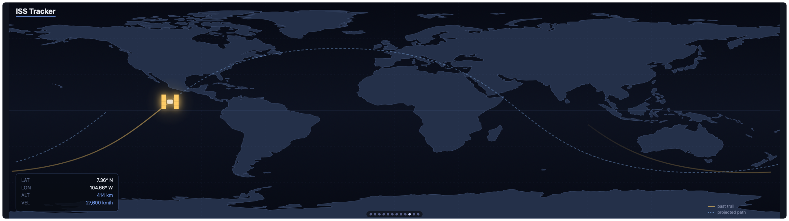

# ISS Tracker

Standalone world map showing the International Space Station's position,
computed locally with [satellite.js](https://github.com/shashwatak/satellite-js)
(MIT) via SGP4 propagation of its orbital elements (TLE).

- **TLE** (two-line element set) is fetched from
  [Celestrak](https://celestrak.org/) once per hour; the current position,
  past trail, and projected future track are all propagated locally every
  second from that TLE, so motion stays smooth between hourly refreshes.
- **Satellite icon** marks the current subpoint — a small central body with
  two solar-panel wings and a soft glow.
- **Trail** (optional) traces the past ~45 minutes of ground track, solid
  amber.
- **Projection** (optional) traces the next ~90 minutes of ground track,
  dashed light blue.
- Both paths split into separate segments at the ±180° seam instead of
  drawing a line across the map.
- Coastlines are optional and drawn from bundled Natural Earth data (no
  network).



## Settings

| Key              | Type    | Default | Description                          |
|------------------|---------|---------|---------------------------------------|
| `showLand`       | boolean | `true`  | Show coastlines                       |
| `showTrail`      | boolean | `true`  | Show past ground-track trail          |
| `showProjection` | boolean | `true`  | Show projected future ground track    |
| `units`          | enum    | `km`    | Altitude/velocity units (km/mi)       |

Note: like other Vardek carousel widgets, this widget's refresh is paused
while its page is off-screen in the carousel and resumes when it becomes
visible again. The TLE is fetched again on resume/refresh; the local
per-second propagation timer only runs while the page is live.

## Install

```sh
./install-addon.sh com.vardek.iss
```

See the [repo README](../README.md) for manual install and uninstall.

## Data

Orbital elements (TLE) for ISS (NORAD ID 25544) from
[Celestrak](https://celestrak.org/NORAD/elements/gp.php?CATNR=25544&FORMAT=tle)
(public, no key required), refreshed hourly. Position, trail, and projected
path are computed locally each second via SGP4 using bundled
[satellite.js v5](https://github.com/shashwatak/satellite-js) (MIT license).
`land.js` bundles simplified Natural Earth 1:110m land polygons (public
domain) — coastlines only, no network for those.
