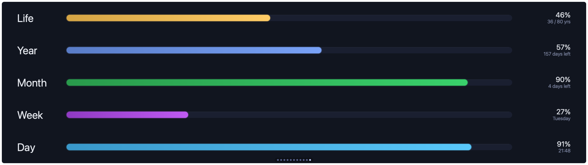

# Life Progress

Horizontal progress bars showing how far along you are in the day, week,
month, year, and (optionally) your life — computed locally from your
device's clock, no network.



## Settings

| Key              | Type    | Default        | Description                  |
|------------------|---------|----------------|-------------------------------|
| `birthDate`      | string  | `"1990-01-01"` | Birth date (YYYY-MM-DD)       |
| `lifeExpectancy` | number  | `80`           | Life expectancy (years)       |
| `showLife`       | boolean | `true`         | Life bar                      |
| `showYear`       | boolean | `true`         | Year bar                      |
| `showMonth`      | boolean | `true`         | Month bar                     |
| `showWeek`       | boolean | `true`         | Week bar                      |
| `showDay`        | boolean | `true`         | Day bar                       |

## Install

```sh
./install-addon.sh com.vardek.life-progress
```

See the [repo README](../README.md) for manual install.
