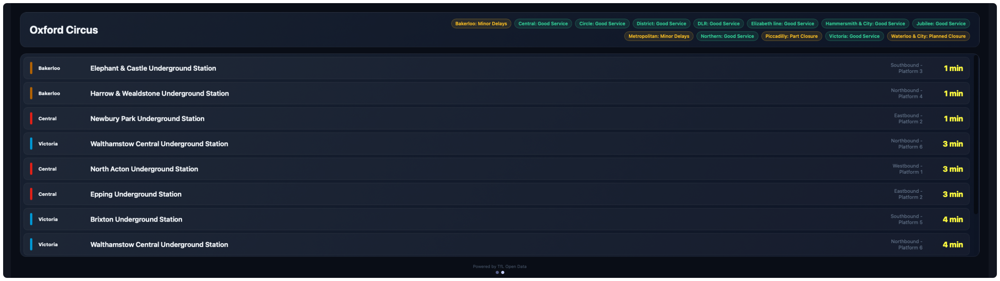
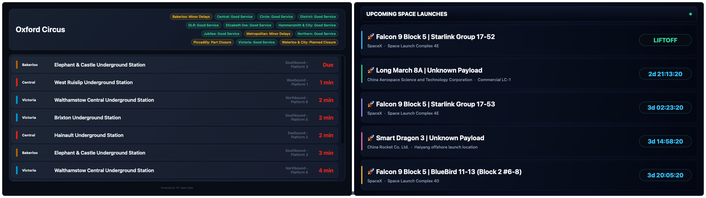

# London Tube

Live London Underground/DLR/Elizabeth line arrivals and line status for a
chosen station — pick a station from the dropdown, get the next arrivals with
platform, destination, and countdown, plus a line-status strip at the top.

Two sizes: 8×2 (full width) or 4×2 (half width, so another widget can share
the page) — text scales to fit either.




## Settings

| Key          | Type   | Default          | Description                                    |
|--------------|--------|------------------|--------------------------------------------------|
| `station`    | enum   | `Oxford Circus`  | Station to show (all 300 Tube/DLR/Elizabeth line stations) |
| `direction`  | enum   | `All`            | `All`, `Inbound`, `Outbound` — only applied when TfL reports a direction for that arrival (often absent on the Underground) |
| `lineFilter` | enum   | `All`            | Restrict to one line, or `All` |
| `walkBuffer` | number | `0`              | Minutes to walk to the platform — hides arrivals you'd miss |
| `accentColor`| color  | `#DC241F`        | Accent color (TfL red by default) |

## Install

```sh
./install-addon.sh com.vardek.london-tube
```

See the [repo README](../README.md) for manual install and uninstall.

## Data

[TfL Unified API](https://api.tfl.gov.uk) — keyless, no account needed.
Arrivals via `/StopPoint/{id}/Arrivals`, line status via
`/Line/Mode/.../Status`. Station names/IDs ship embedded in the widget (TfL's
own public Naptan stop data), so there's no lookup round trip. TfL's anonymous
tier is rate-limited but fine for one panel — requests are confined to
`https://api.tfl.gov.uk/**` via the widget's proxy allowlist.

Not intended for time-critical use — treat it as informational only.

## Attribution

Powered by TfL Open Data (`api.tfl.gov.uk`). Per TfL's developer terms, the credit "Powered by TfL Open Data" is
shown in the widget itself as well as here.
