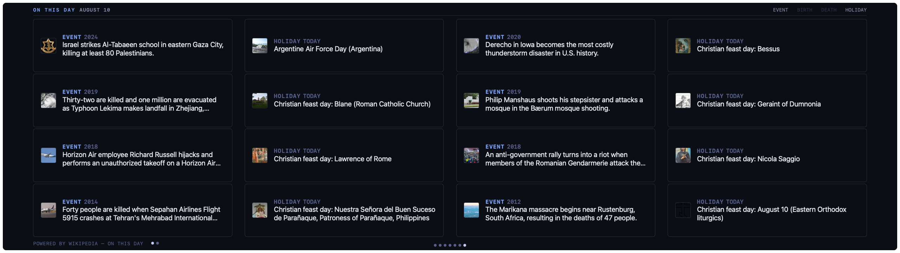

# On This Day

A gallery wall of Wikipedia's "On this day" historical anniversaries — a
dense 4×4 grid of plaque cards (category, year, headline, thumbnail) that
pages through events, births, deaths, and holidays for today's date, turning
to the next page on a timer instead of creeping one item at a time.



- **Pick your categories.** Events, births, and deaths are on by default;
  holidays/observances are off (they skew country-specific and crowd out
  world history) — toggle any of the four independently.
- **Pages, not a slow crawl.** All enabled categories are interleaved and
  paged 16-at-a-time so a glance actually sees a full wall of facts, not one
  item creeping across the screen; page dots at the bottom jump straight to
  any page, and hovering a card pauses the auto-page timer.
- **Tap any placard** to open its Wikipedia article in your default browser.

## Settings

| Key              | Type    | Default | Description                                 |
|------------------|---------|---------|----------------------------------------------|
| `lang`           | string  | `en`    | Wikipedia language edition (`en`, `de`, `fr`, `ja`, …) |
| `show_events`    | boolean | `true`  | Show historical events                       |
| `show_births`    | boolean | `true`  | Show notable births                          |
| `show_deaths`    | boolean | `true`  | Show notable deaths                          |
| `show_holidays`  | boolean | `false` | Show holidays & observances                  |
| `rotate_seconds` | enum    | `12`    | Seconds between page turns (8/12/16/20)       |

## Install

```sh
./install-addon.sh com.vardek.otd
```

See the [repo README](../README.md) for manual install and uninstall.

## Data

[Wikipedia REST API — "on this day" feed](https://en.wikipedia.org/api/rest_v1/feed/onthisday/events/{mm}/{dd})
(public, keyless), one request per enabled category per refresh. Each
category is capped to 16 entries client-side so one prolific category
(births regularly returns 250+) can't crowd out the others.

**API limit:** per the
[Wikimedia API rate-limit policy](https://www.mediawiki.org/wiki/Wikimedia_APIs/Rate_limits),
unauthenticated requests with a compliant `User-Agent` are limited to 200
requests/minute (10/minute with no identifying `User-Agent` at all). This
widget makes up to 4 requests per refresh (one per enabled category) at its
default 3600s (1 hour) `refreshInterval` — well under either limit; the
underlying content only changes once a day regardless.
