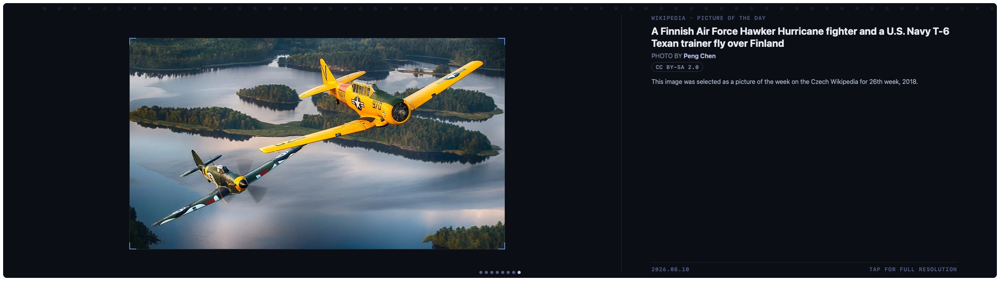

# Picture of the Day

A darkroom contact-sheet frame for Wikipedia's daily featured photo — the
image sits full-frame behind a hairline mount with corner brackets, a
proof-sheet column on the right carries the headline, photographer credit,
license, and caption. Tap the frame to open the full-resolution file on
Wikimedia Commons.



## Settings

| Key    | Type   | Default | Description                                    |
|--------|--------|---------|-------------------------------------------------|
| `lang` | string | `en`    | Wikipedia language edition (`en`, `de`, `fr`, `ja`, …) |

## Install

```sh
./install-addon.sh com.vardek.potd
```

See the [repo README](../README.md) for manual install and uninstall.

## Data

[Wikipedia REST API — featured content feed](https://en.wikipedia.org/api/rest_v1/feed/featured/{yyyy}/{mm}/{dd})
(public, keyless, one request per refresh). If today's picture isn't
published yet for the selected language edition, the widget falls back to
yesterday's.

**API limit:** per the
[Wikimedia API rate-limit policy](https://www.mediawiki.org/wiki/Wikimedia_APIs/Rate_limits),
unauthenticated browser/bot requests with a compliant `User-Agent` are
limited to 200 requests/minute (10/minute with no identifying `User-Agent`
at all). This widget makes 1 request per refresh at its default 3600s (1
hour) `refreshInterval` — 24 calls/day per installed instance, far under
either limit; the picture only changes once a day regardless.
