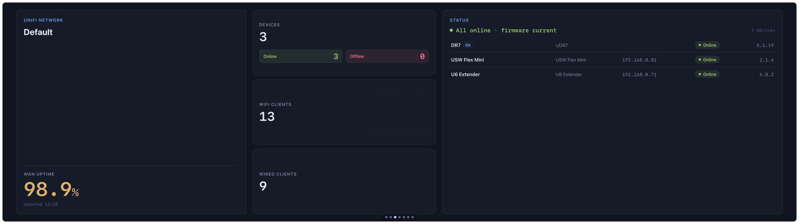

# UniFi Network Widget

Three-panel network dashboard — site info and WAN uptime on the left, client and device counts in the centre, and a full device infrastructure table on the right.

---

## Panels

| Panel | Content |
|---|---|
| **Site** | Site name, ISP, WAN uptime percentage (colour-coded healthy/warning/critical), timezone |
| **Stats** | Total network devices with online/offline breakdown, WiFi client count, wired client count |
| **Devices** | All infrastructure devices — name, model, IP address, online/offline status, firmware version with update indicator |

---

## Data Source

[UniFi Cloud API](https://api.ui.com/ea) — Ubiquiti's official cloud API for UniFi OS consoles. Requires a personal API key from your Ubiquiti account.

---

## API Key

**Required.** A UniFi API key tied to your Ubiquiti account is needed.

### Getting a UniFi API key

1. Go to [account.ui.com](https://account.ui.com) and sign in.
2. Navigate to **Security → API Tokens**.
3. Create a new token with read access to your sites and devices.
4. Copy the generated key — it is only shown once.

### Entering the key

1. Open the Vardek Admin panel.
2. Select **UniFi Network** in the widget list.
3. Paste your UniFi API key into the **UniFi API Key** field and save.

The key is stored in the macOS **Keychain** and never exposed to the widget itself — Vardek attaches it server-side to requests for the widget's one permitted host.

---

## Settings

| Setting | Type | Description |
|---|---|---|
| **UniFi API Key** | Secret | Your UniFi Cloud API key |

---

## Notes

- Data refreshes every 5 minutes (`refreshInterval: 300`).
- The widget reads the first site returned by the API. Multi-site setups will show whichever site the API returns first.
- WAN uptime is colour-coded: green ≥ 99 %, yellow ≥ 95 %, red below 95 %.
- Devices showing **Update** have `firmwareStatus: "update_available"` — updates must be applied from the UniFi dashboard.
- The proxy is scoped to `https://api.ui.com/ea/**` only; the widget cannot make requests to any other host.
