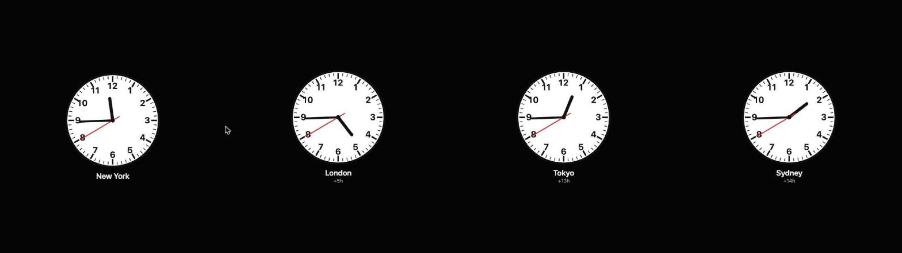

# World Clocks

Newsroom-wall-clock-style display of 2-4 analog clocks at once — white
face, black hour/minute hands, sweeping red second hand, classic 1-12
numerals. Pick 2 to 4 cities from the dropdowns; each clock is labeled with
its city name and its time difference relative to the first city (the
first clock shows no offset).



At 8×2 all clocks share a single row, scaling to fill the width. At 4×2,
two cities still sit side by side; three or four wrap into a 2×2 grid so
each clock stays a readable size.

## Settings

| Key     | Type | Default                 | Description                                    |
|---------|------|--------------------------|-------------------------------------------------|
| `city1` | enum | `New York, United States` | First clock (required, no "None")              |
| `city2` | enum | `London, United Kingdom`  | Second clock (required, no "None")             |
| `city3` | enum | `Tokyo, Japan`             | Third clock, or "None" to show only 2 clocks   |
| `city4` | enum | `None`                     | Fourth clock, or "None" to show 2-3 clocks     |

## Install

```sh
./install-addon.sh com.vardek.world-clocks
```

See the [repo README](../README.md) for manual install and uninstall.

## Notes

Local time only — no network permissions. Timezones come from the
browser's own `Intl` API (DST-aware), same city list as the bundled
Weather widget.
